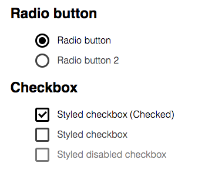

# CSS3-checkbox

**What you will find here?**

Easy to customize, styled checkbox and radio button.

**DEMO**

> http://codepen.io/dzentbolas/pen/OyGeaj

**How to use**

    

	    <input id="checkbox1" type="checkbox">
	    <label for="checkbox1">
	        Default
	    </label>
	

	

	    <input id="radio1" type="radio" name="radio-group">
	    <label for="radio1">
	        Default
	    </label>
	

**Compatability**

IE9+, Chrome, Firefox, Safari, iOs, Android

For Android <= 4.1.2 and iOS < 6.0 bugs used

> http://timpietrusky.com/advanced-checkbox-hack

